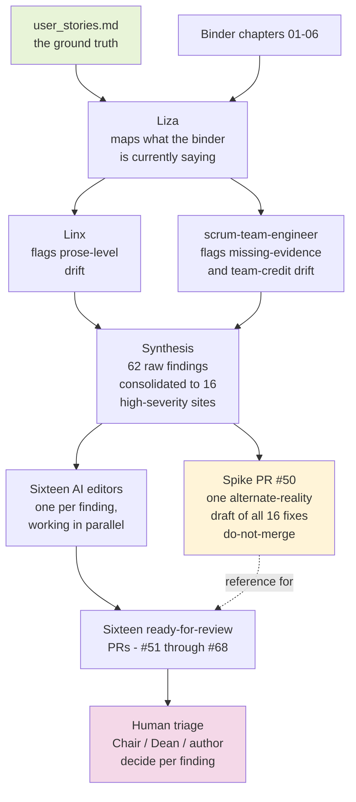
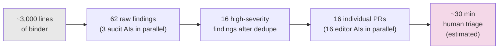

# How We Audited the Spring 2026 Binder With a Team of AI Assistants

**Date:** 2026-05-17
**Audience:** Chair, Dean, admin staff, and anyone curious about the process
**TL;DR:** We had a 3,000-line binder that needed an honest comparison against a short ground-truth document. We used a small team of AI assistants in carefully sequenced roles — not one big AI doing everything — to find where the binder had drifted, draft what corrections might look like, and turn each correction into an individually reviewable change. The result is sixteen self-contained edit proposals, each tied to a specific finding, all ready for a human to accept, modify, or decline.

---

## The problem in one paragraph

The performance review binder is six chapters and roughly 3,000 lines of prose. It was written confidently. The author also wrote a short, dry ground-truth document (`user_stories.md`) saying plainly: *the three objectives I was assigned were modest, I quietly overdelivered, please rate me Meets Expectations.* When you read the binder against that document, you can feel that they're aimed at different reviewer reactions. The binder reads as evidence for an *Exceeds* outcome. The ground truth asks for a *Meets* outcome. Both could be honest at once — but the binder, as written, doesn't make space for the second.

The audit's job: name every place that mismatch shows up, propose a fix for each, and put a human in position to triage them one at a time.

---

## The shape of the work

The structure has three layers, each with a different job:

**Layer 1 — Diagnostic.** A small team of three AI assistants (named, with deliberately different roles) read both documents and produced a comparison. *Liza* characterized what frame each chapter installs in the reader's mind. *Linx* logged every sentence-level place where the binder's word choices install a different frame than the ground-truth document does. *scrum-team-engineer* logged places where claims need evidence the binder doesn't provide, or where team credit is muted. We then merged their three reports into one consolidated findings document, classified by severity.

**Layer 2 — Visualization.** A second wave of six AI assistants — one per chapter — produced a single "what would the binder look like if we applied all the high-severity fixes" draft, on a branch (PR #50). That draft is explicitly *not for merging*. Its job is to show the human what the corrections feel like in actual prose before they decide which to accept.

**Layer 3 — Per-finding edits.** A third wave of sixteen AI assistants — one per high-severity finding — produced sixteen separate edit proposals, each as its own GitHub Pull Request that closes exactly one tracked finding. These are ready for human review one at a time.

---

## Why we couldn't just ask one AI to do all of it

This was the load-bearing design decision and it's worth naming.

> A confident, internally consistent document is not the same as a correct one. A sufficiently well-written binder can sweep an AI reviewer along — the AI starts agreeing with the binder's framing instead of comparing the binder to the source of truth.

So we built two structural protections in:

1. **Frame-break.** Every AI assistant in the pipeline was instructed to read the short ground-truth document *first*, write its single-sentence ask in their own words at the top of their scratchpad, *then* open the binder. The binder's prose can't override the ground-truth frame if the ground-truth frame is the reading lens from the first word.

2. **Role separation.** No assistant in the pipeline did all the work end-to-end. Each one had a tight job (map frames; flag prose drift; flag missing evidence; produce one chapter's draft; propose one finding's fix) and a hard constraint against doing the next job in the chain.

These protections are why the same kind of AI you can chat with in a browser produced 62 grounded findings here instead of the sort of *"this is great, here are some minor polishing suggestions"* output that would have absorbed the binder's confidence.

---

## What got built

| Artifact | What it is | Where it lives |
|---|---|---|
| 4 AI assistant role files | The persona definitions for Liza, Linx, scrum-team-engineer, and a GitHub-operations assistant (Kevin) | `.claude/agents/*.md` |
| Audit spec | The plan that produced the audit | `docs/superpowers/specs/2026-05-17-thesis-audit-design.md` |
| Findings document | 16 high-severity findings, each with location, current frame, target frame, and proposed fix | `docs/audits/2026-05-17-thesis-audit.md` |
| Spike PR #50 | One do-not-merge draft showing all 16 fixes applied at once | branch `spike/thesis-audit-reframe-draft` |
| 16 follow-up PRs (#51-#68) | One self-contained edit proposal per finding, each closing one tracked issue | branches `fix/hf-1-*` through `fix/hf-16-*` |
| Merge plan | Recommended order for accepting the 16 PRs, with conflict notes | `docs/audits/2026-05-17-merge-plan.md` |

---

## Numbers at a glance

- **AI assistants used:** 26 total across all three waves (3 + 6 + 1 + 16), each scoped to one job
- **Wall-clock time for the pipeline:** ~3 hours from initial brainstorm to all 16 PRs open
- **Per-PR diff size:** smallest is one line (#66, FTCC-ahead-of-NCCCS clause); largest is ~50 lines (#67, threat-evidence compression)
- **PRs requiring deliberate manual merge:** 2 of 16 (where two findings propose competing rewrites of the same paragraph — that's the human's call, by design)

---

## What the human does next

The pipeline ends at the human. The sixteen PRs are *proposals*, not decisions. For each one, the reviewer (Chair, Dean, author, or any combination) does one of three things:

- **Accept** — merge the PR; the binder absorbs the fix.
- **Modify** — pull the PR locally, adjust the wording, push back, then merge.
- **Decline** — close the PR; add a comment explaining the decision; the original finding stays in the audit document as a documented "considered and rejected" item.

The merge plan (`docs/audits/2026-05-17-merge-plan.md`) recommends an order that minimizes rebase work — nine of the sixteen are independent and can land in any order without conflicts.

---

## Glossary

- **Anchor document** — the short ground-truth document (`user_stories.md`) that the audit compares the binder against.
- **Frame** — in the audit's usage, the interpretive container a piece of writing installs in the reader's mind. A confident document installs a confident frame; a humble document installs a humble frame. Frame mismatch between two related documents is what the audit hunts for.
- **High-severity finding** — a place where, if the prose stays as written, the reader's takeaway about the chapter materially changes from what the anchor document asks for.
- **Pull Request (PR)** — a packaged proposed edit on GitHub, with a description, a diff, and a button to accept it.
- **Issue** — a tracked item on GitHub used here to represent one high-severity finding. Each follow-up PR closes one issue when accepted.
- **The spike (PR #50)** — the do-not-merge alternate-reality draft. It exists for visualization only; it is not part of the merge plan.
